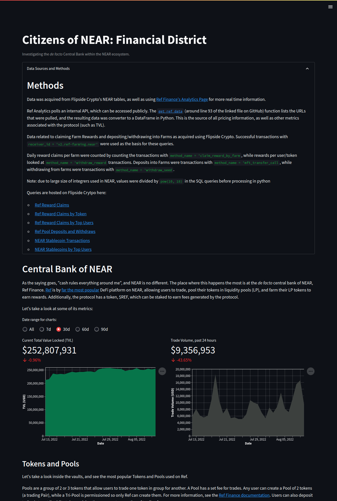
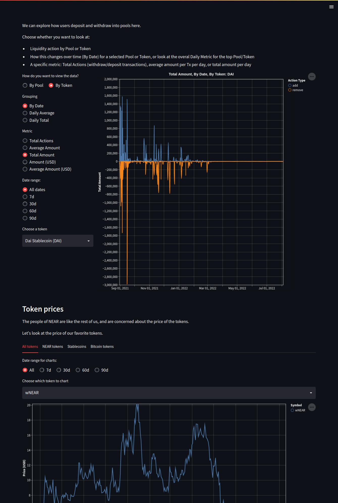
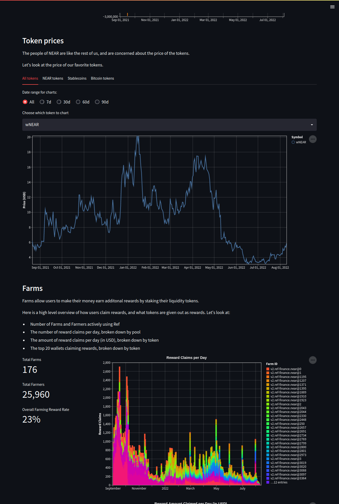

# Near Finance submission
This dashboard was built using streamlit, which is having deployments issues at the moment.

**Update**: the app is now deployed on Heroku. Please go to this webside to view the live dashboards:
- https://near-financial-district.herokuapp.com/

Code is here:
- https://github.com/ltirrell/flipside_bounties/blob/main/near/finance.py
- https://github.com/ltirrell/flipside_bounties/blob/main/near/fin_utils.py

## Images
Here are images of the rendered dashboard:

